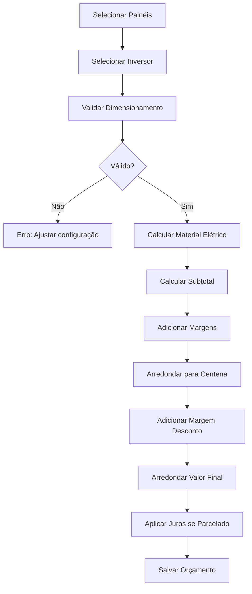

# Cálculos de Orçamentos - CRM Solar

## 📊 Visão Geral

Este documento detalha todos os cálculos realizados no sistema de orçamentos do CRM Solar.

---

## 🔌 Dimensionamento de Inversores

### Overload por Fabricante

O overload é a capacidade adicional que o inversor suporta além de sua potência nominal.

| Fabricante | Overload | Capacidade Real |
|------------|----------|-----------------|
| **Solis** | 70% | 1.70x |
| **SAJ** | 100% | 2.00x |
| **Deye** | 50% | 1.50x |
| **Growatt** | 50% | 1.50x |
| **ABB** | 50% | 1.50x |
| **Fronius** | 50% | 1.50x |
| **SMA** | 50% | 1.50x |
| **Huawei** | 50% | 1.50x |
| **Goodwe** | 50% | 1.50x |
| **Outros** | 50% | 1.50x (padrão) |

### Fórmula de Validação

```
Potência dos Painéis (W) = Quantidade × Potência Unitária
Capacidade Máxima do Inversor (W) = Potência Nominal × Overload × Quantidade

Válido se: Potência dos Painéis ≤ Capacidade Máxima do Inversor
```

### Exemplo Prático

**Cenário:**
- 11 painéis de 705W = 7.755W
- 1 inversor Solis de 5.000W (overload 1.70)

**Cálculo:**
```
Capacidade Máxima = 5.000W × 1.70 = 8.500W
7.755W ≤ 8.500W ✅ VÁLIDO
Overload Usado = (7.755 / 5.000 - 1) × 100 = 55,1%
```

---

## 💰 Cálculo de Valores

### PERCENTUAIS PADRÃO (configuráveis nas premissas)

| Item | % Padrão | Base de Cálculo |
|------|----------|----------------|
| **Comissão** | 5% | Valor Final |
| **Imposto** | 6% | Valor Final |
| **Lucro** | - | Residual (Valor Final - Custo - Comissão - Imposto) |
| **Margem Desconto** | 2% | Valor de Venda |

---

### FLUXO DE CÁLCULO EM 2 PASSOS

#### PASSO 1: Calcular Custo Total

```
CUSTO TOTAL = Kit + Projeto + Montagem + Estrutura + Material Elétrico + Adicionais + Deslocamento
```

**Componentes:**
- **Kit**: Cotação do fornecedor
- **Projeto**: Configurado nas premissas
- **Montagem**: Quantidade Painéis × Valor/Painel
- **Estrutura**: Baseado no tipo de telhado
- **Material Elétrico**: Baseado na potência do INVERSOR
- **Adicionais**: String box, etc
- **Deslocamento**: Custo combustível (se aplicável)

#### PASSO 2: Estimar Valor com Markup

```
Comissão Estimada = Custo × 5%
Lucro Estimado = Custo × 18%
Imposto Estimado = Custo × 6%

VALOR ESTIMADO = Custo + Comissão Est. + Lucro Est. + Imposto Est.
```

#### PASSO 3: Arredondar para Centena

```
VALOR DE VENDA = ARREDONDAR_CIMA(Valor Estimado)
```

**Regra:** Sempre para CIMA, centena mais próxima
- R$ 15.892,80 → R$ 15.900,00
- R$ 12.340,00 → R$ 12.400,00

#### PASSO 4: Adicionar Margem de Desconto

```
Margem Desconto (2%) = Valor de Venda × 2%
Valor com Margem = Valor de Venda + Margem Desconto
```

#### PASSO 5: Arredondar Valor Final

```
VALOR FINAL = ARREDONDAR_CIMA(Valor com Margem)
```

#### PASSO 6: Calcular Valores REAIS

```
Comissão REAL (5%) = Valor Final × 5%
Imposto REAL (6%) = Valor Final × 6%
Lucro REAL = Valor Final - Custo Total - Comissão REAL - Imposto REAL
```

---

### EXEMPLO COMPLETO

```
1. CUSTO TOTAL:                          R$ 12.320,00

2. ESTIMATIVA COM MARKUP:
   + Comissão Est. (5%):    R$    616,00
   + Lucro Est. (18%):      R$  2.217,60
   + Imposto Est. (6%):     R$    739,20
   = Valor Estimado:        R$ 15.892,80

3. ARREDONDAR:                            R$ 15.900,00

4. MARGEM DESCONTO (2%):                  R$    318,00
   = Valor com Margem:                    R$ 16.218,00

5. ARREDONDAR FINAL:                      R$ 16.300,00

6. BREAKDOWN REAL:
   Comissão (5%):           R$    815,00
   Imposto (6%):            R$    978,00
   Lucro (Residual):        R$  2.187,00
   ────────────────────────────────────
   Total:                   R$  3.980,00
   
   Verificação: R$ 16.300 - R$ 12.320 = R$ 3.980 ✓
```

---

### Material Elétrico

**IMPORTANTE:** Baseado na potência do INVERSOR!

```
Potência (kWp) = (Potência Inversor × Quantidade) / 1000
```

Faixas (exemplo):
- Até 5 kWp: R$ 700,00
- Até 8 kWp: R$ 900,00
- Até 12 kWp: R$ 1.200,00
- Acima: R$ 1.500,00

---

### Parcelamento

```
Valor Final Parcelado = Valor Final × (1 + Taxa%)
Valor Parcela = Valor Final Parcelado / Nº Parcelas
```

**Taxas (exemplo):**
- 2x: 2,5%
- 3x: 3,5%
- 6x: 5,0%
- 12x: 8,0%

---

## 🔄 Fluxo de Cálculo



---

## 🛠️ Scripts de Manutenção

### Recalcular Orçamentos

Recalcula todos os orçamentos existentes com as fórmulas atualizadas:

```bash
docker-compose exec backend python recalcular_orcamentos.py
```

### Corrigir Overload dos Inversores

Atualiza os valores de overload por fabricante:

```bash
docker-compose exec backend python corrigir_overload.py
```

---

## 📝 Notas Importantes

1. **Material Elétrico**: Sempre baseado na potência do INVERSOR, não dos painéis
2. **Arredondamento**: Sempre para CIMA, para centena mais próxima
3. **Overload**: Varia por fabricante, verificar tabela antes de dimensionar
4. **Margens**: Aplicadas sobre o subtotal, não sobre o valor final
5. **Desconto**: A margem de desconto permite oferecer até X% de desconto à vista

---

## 🔍 Troubleshooting

### Problema: Material elétrico muito alto/baixo
**Solução:** Verificar se está usando potência do inversor, não dos painéis

### Problema: Dimensionamento inválido
**Solução:** Verificar overload do fabricante e ajustar quantidade de inversores

### Problema: Valores não arredondados
**Solução:** Executar script `recalcular_orcamentos.py`

### Problema: Overload incorreto
**Solução:** Executar script `corrigir_overload.py`

---

**Última atualização:** 2024
**Versão:** 1.0
